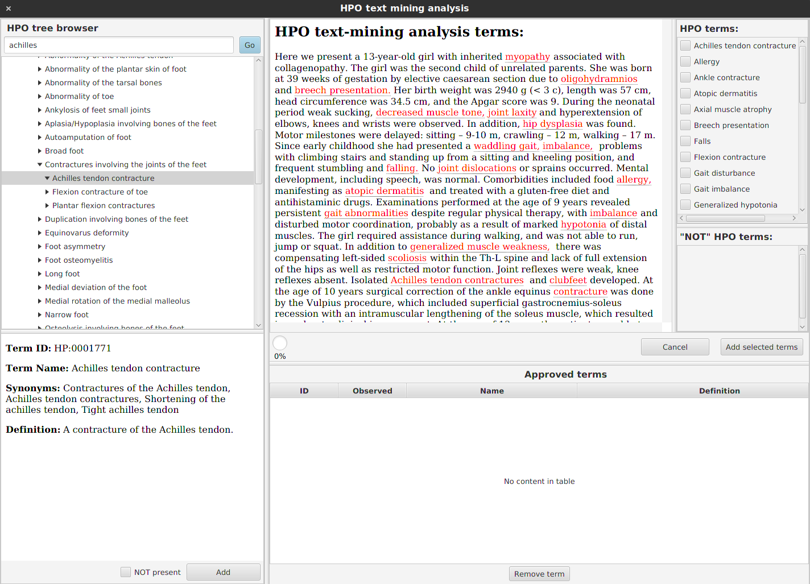

[](https://maven-badges.herokuapp.com/maven-central/org.monarchinitiative.hpotextmining/HpoTextMining)

# HpoTextMining
*HpoTextMining* allows convenient curation of phenotype information from free-text in English by using [Monarch SciGraph](https://scigraph-ontology.monarchinitiative.org/scigraph/annotations/complete) instance.

## Aim
The aim of *HpoTextMining* is to allow easy & convenient curation of phenotypic information using Human Phenotype Ontology (HPO).

The app consists of following three modules:

- `hpotextmining-core` module sends query to the server and decodes the response. The response consists of a set of tokens (`MinedTerm`) that contain ID of the identified term as well as coordinates of the query region based on which the token was identified.
- `hpotextmining-gui` module offers an interface for your GUI written in *JavaFX*.
- `hpotextmining-demo` shows an example how to plug the `hpotextmining-gui` into your GUI

## How to use as a plugin in *JavaFX* application
In order to plug *HpoTextMining* into your *JavaFX* app, add the following dependency into your `pom.xml`. Then, see the `Play` and `Controller` classes of the *hpotextmining-demo* module to see an example.

```
<!-- HpoTextMining GUI interface -->
<dependency>
    <groupId>com.github.monarch-initiative</groupId>
    <artifactId>hpotextmining-gui</artifactId>
    <version>0.2.5</version>
</dependency>
```

### The dialog window



The *HpoTextMining* presents a dialog window to the curator/user. The dialog window consists of following subparts:

- **approved terms table** - table (at the bottom) that contains the approved phenotype terms. The terms which are inside the table will be available as results after closing the dialog window
- **ontology tree pane** - tree hierarchy of the ontology is displayed on the left side of the dialog. User can expand individual levels and add selected terms into the approved terms table
- **text-mining pane** - an area, where the user submits a query text that is mined for HPO terms. After the text mining, results are presented in the same area. The parts of a query text, where a HPO terms were identified, are highlighted with red. It is possible to see context of the highlighted HPO term in the ontology graph by clicking on the highlighted text. 
  A sorted list of the HPO terms is displayed on the right side, where user is expected to review the results and approve the correctly identified terms. After marking all correct terms and clicking on the *Add selected terms* button, the terms will be transfered into the *approved terms table* described above.


## How to use the text mining functionality

If you are only interested in the plain-text analysis, then the `hpotextmining-core` will fit your needs.

```xml
<dependency>
    <groupId>com.github.monarch-initiative</groupId>
    <artifactId>hpotextmining-core</artifactId>
    <version>0.2.5</version>
</dependency>
```

